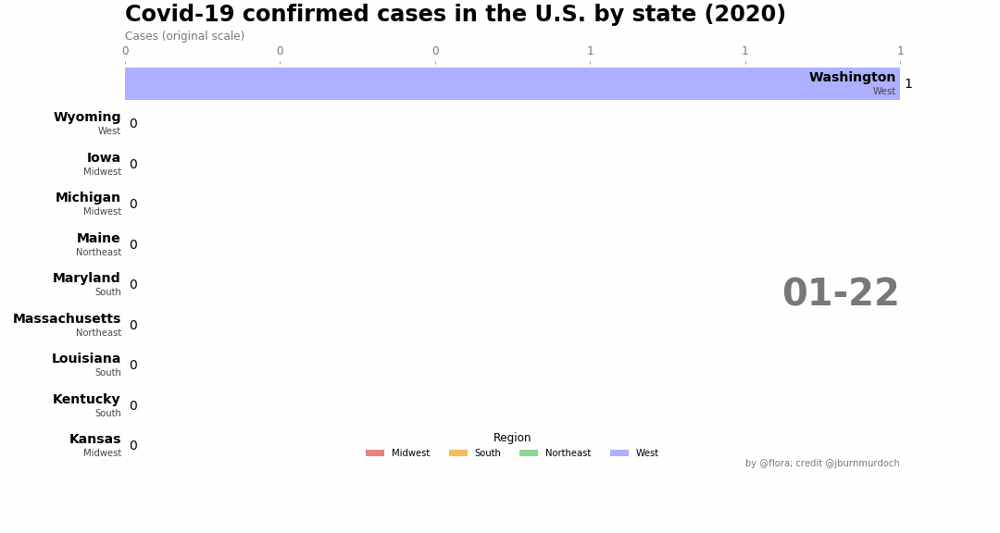
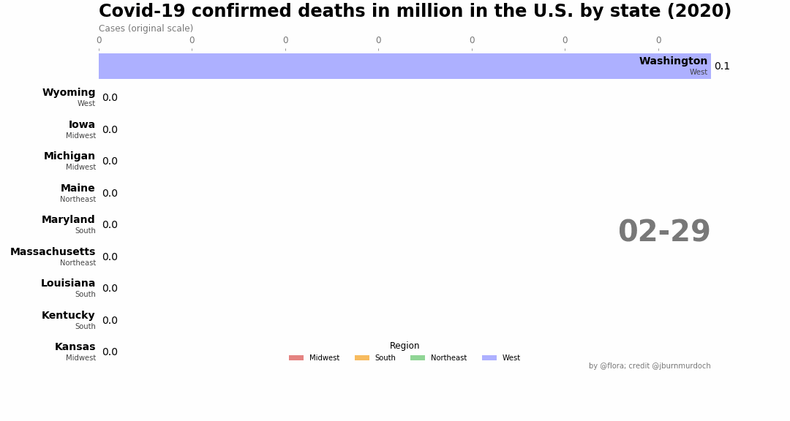

# covid19-vis
some experimental plots

data source: [JHU CSSE](https://github.com/CSSEGISandData/COVID-19)

## accumulated cases by state
The visulaization starts at 01/22/20, two days after the first confirmed case was reported in Washington as no immediate new cases was reported on 01/21/20. 

## accumulated deaths per million by state
[The first reported death in the US from covid-19 took place in Washington.](https://www.cdc.gov/media/releases/2020/s0229-COVID-19-first-death.html)

The deaths in the barplots were normalized by the state population. 

 

## daily increase in cases by state
The start date was set 02/29/20, the day when the increase is taking off. 

