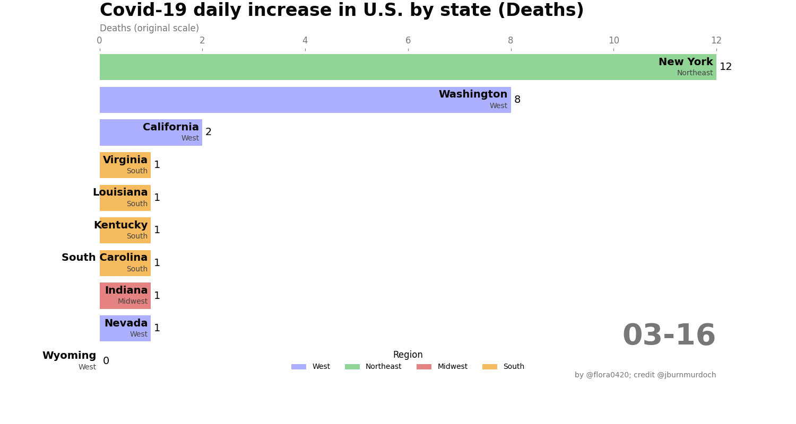

# covid19-vis
some experimental plots

data source: [JHU CSSE](https://github.com/CSSEGISandData/COVID-19)

## daily increased cases by state
The visulaization starts at 03/06/20, starting when at least 10 states steadily saw more than one confirmed cases.  Note that the first confirmed case was reported in Washington on 01/19/20. 

## daily deaths by state

The deaths in the barplots were normalized by the state population. 

 

